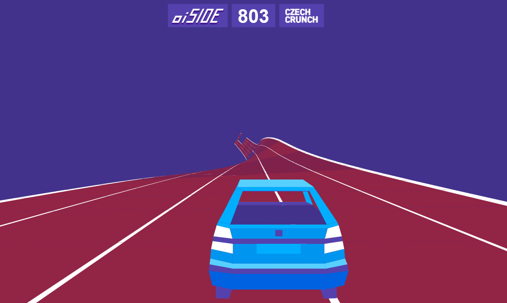
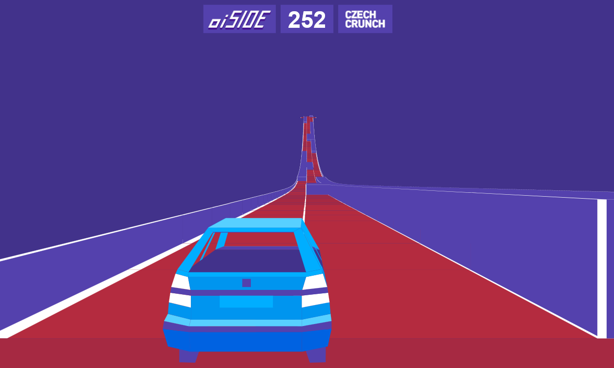
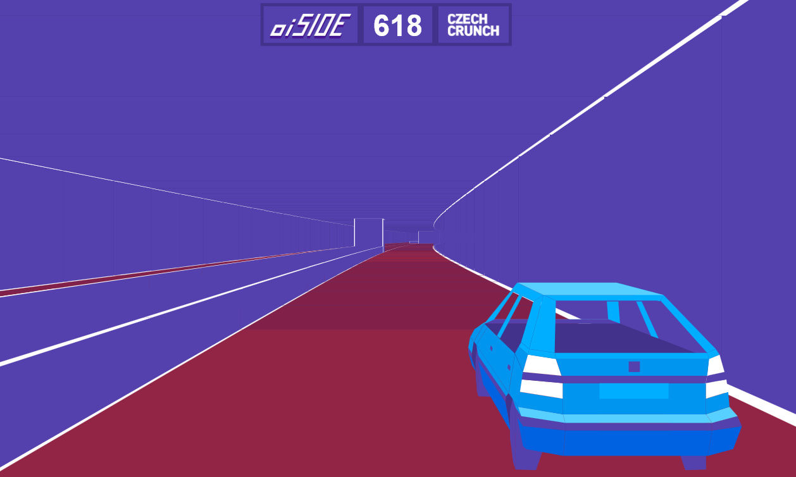

# Fabulous Infinidrive of Good Old Felda

> Retro-style web-based endless racing game.
> Template-based procedural generator of road sections with segment lengths, curvatures, elevation changes, lane configurations, and obstacles.
> Custom pseudo-3D rendering engine supporting road segment rotations.

Project for [Czech Crunch game special](https://cc.cz/ceskehry/), written in TypeScript in 2023.
It uses a fully-custom pseudo-3D renderer that draws directly into an HTML canvas.
You can try [the project](https://oi-side.pages.fel.cvut.cz/projekty/czech-crunch/) in your browser.
It was also meant to be a [GitLab tutorial](https://gitlab.fel.cvut.cz/oi-side/projekty/czech-crunch/-/commit/ddc6cbb5e96adc3feee1e7c4d072e3ee5a227587) (in Czech), but was never finished.

