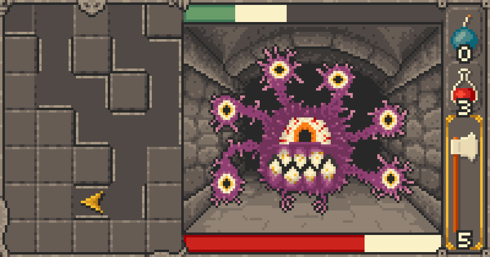
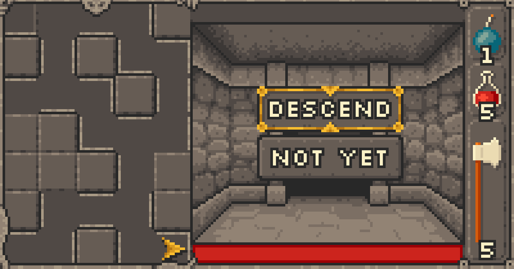
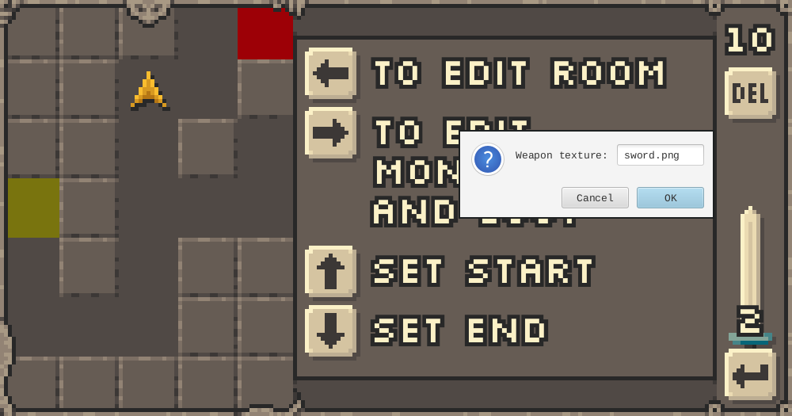
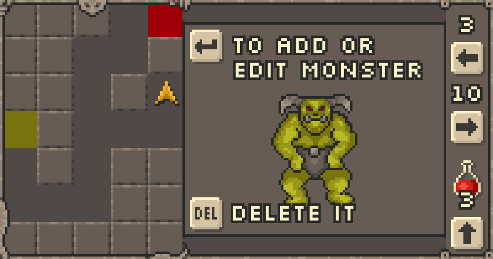

# Java Master: the Legend of Segfault

> Retro-style dungeon crawler with a built-in level editor with support for multiple levels and serialization to plain-text files.
> Grid-based exploratory movement, turn-based combat, inventory management system with weapon upgrades.

Project for [Programming in Java](https://bilakniha.cvut.cz/en/predmet5010706.html) course, written in Java in 2020 by two people.

