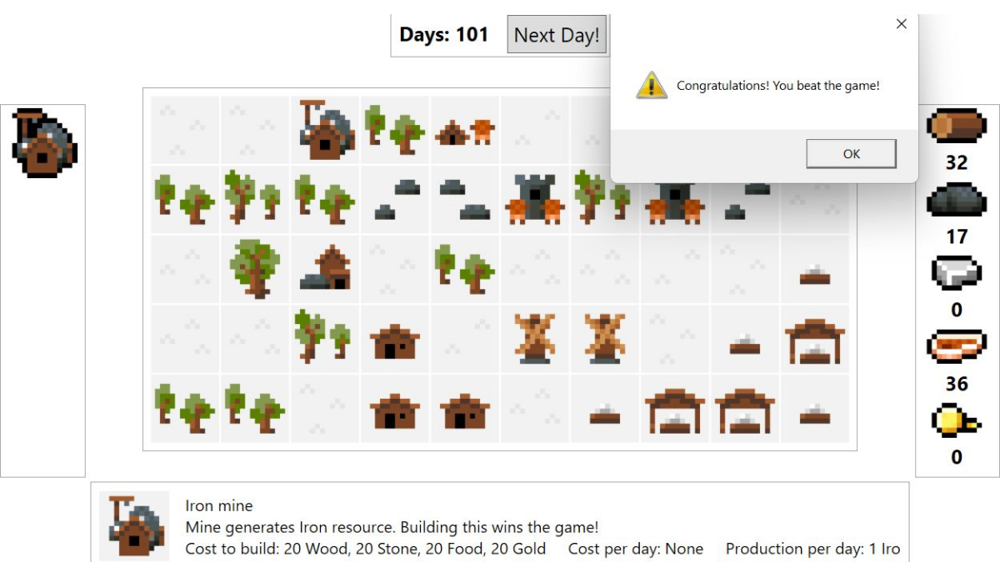

# Settlement Builder

> Resource management settlement builder built on Windows Presentation Foundation framework.
> Model-View-ViewModel pattern, custom controls, data binding and commands.

Project for [User Interfaces Implementation](https://bilakniha.cvut.cz/en/predmet4699206.html) course, written in C#.

