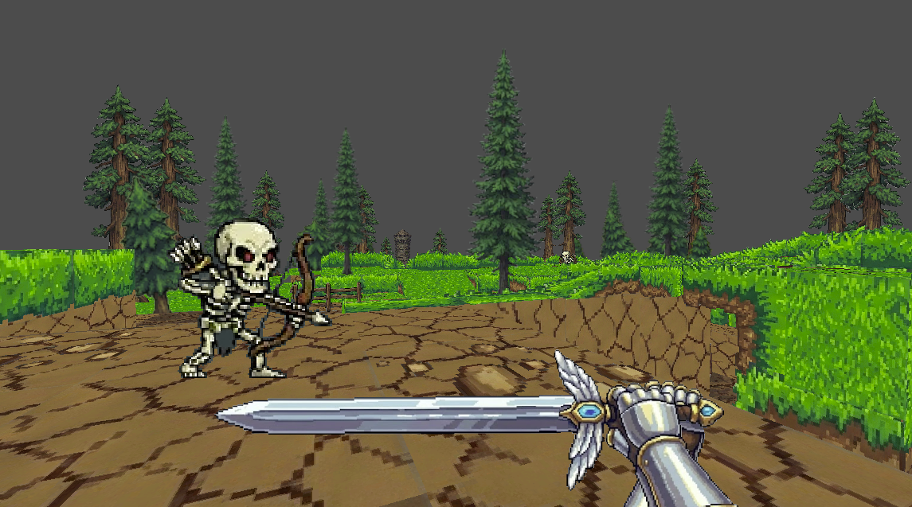
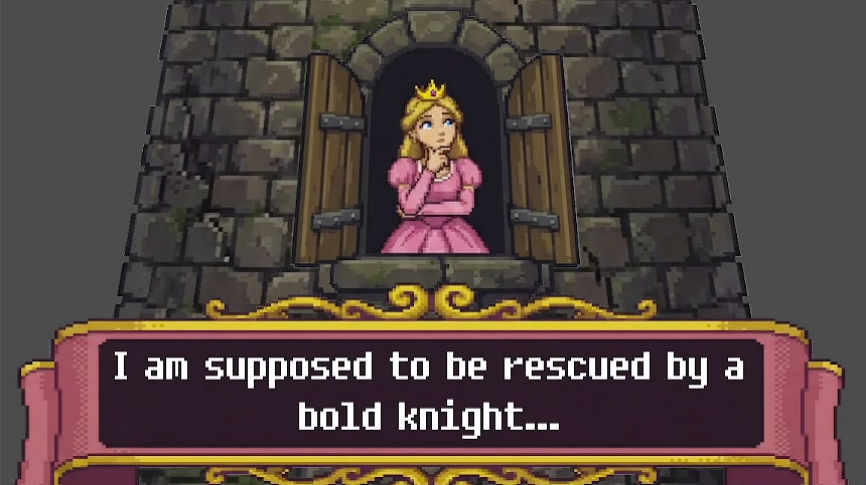
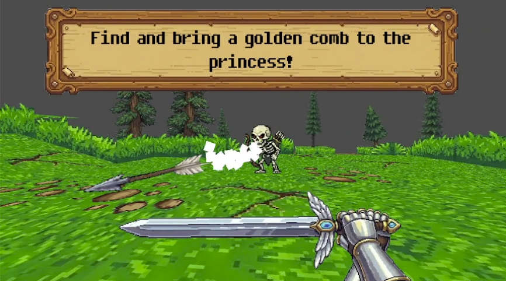

# The Bold Bald Knight

> Quest-based game jam game with AI generated assets.
> Simple combat, item pick-ups, and cutscenes.

Project for [GDS Prague Game Jam 2025](https://itch.io/jam/gds-prague-game-jam-2025), written in Godot Engine in 2025 in 48 hours.
I have unfortunately missed the submission deadline.
All the sprites were generated with Google's NanoBanana Pro.
You can download an executable from [the project archive](https://profojak.itch.io/the-bold-bald-knight).

