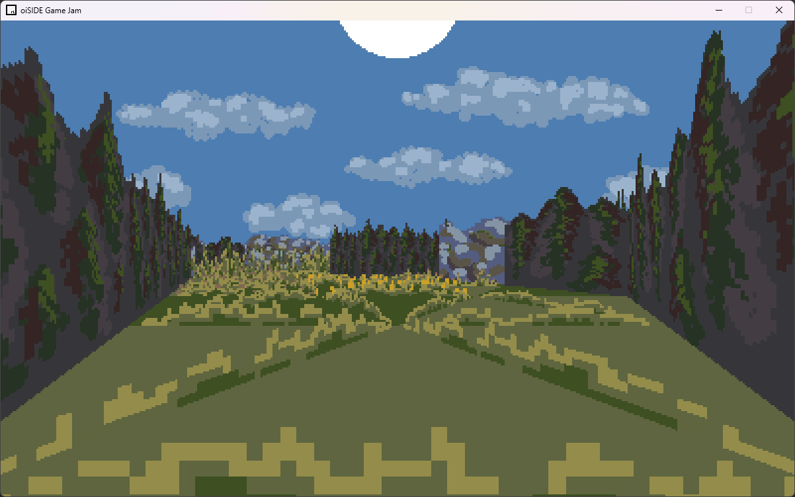
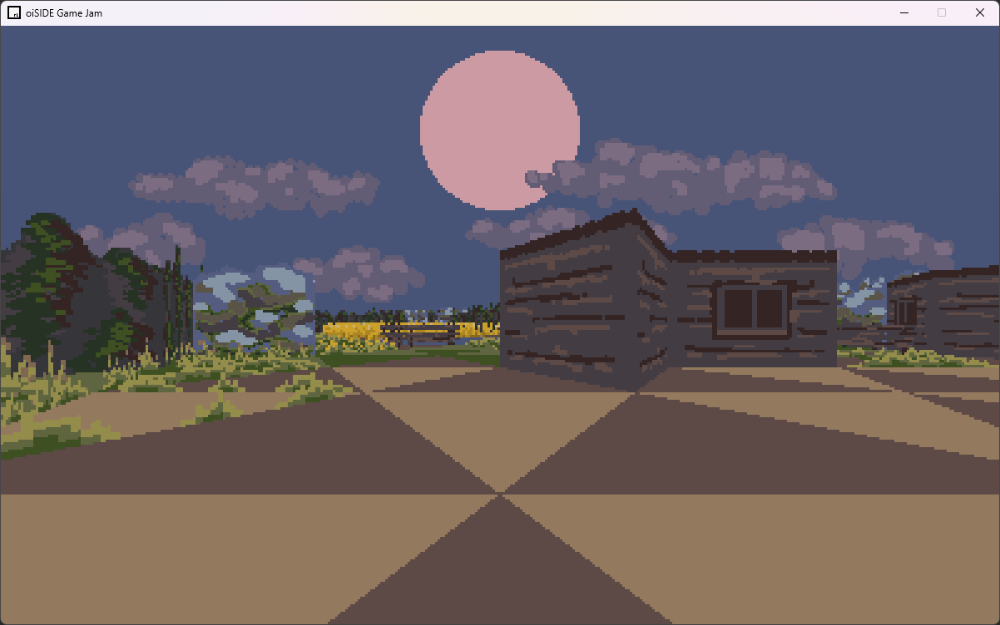

# Vlkodlak

> Dungeon-crawler game jam game with a triangular grid for movement.

Project for [oiSIDE Game Jam #1](https://itch.io/jam/oiside-game-jam-1), written in C++ in 2025 in 48 hours.
It was the very first game jam at FEE CTU, co-organized by me and my colleague at oiSIDE.
You can download an executable from [the project archive](https://profojak.itch.io/vlkodlak).

