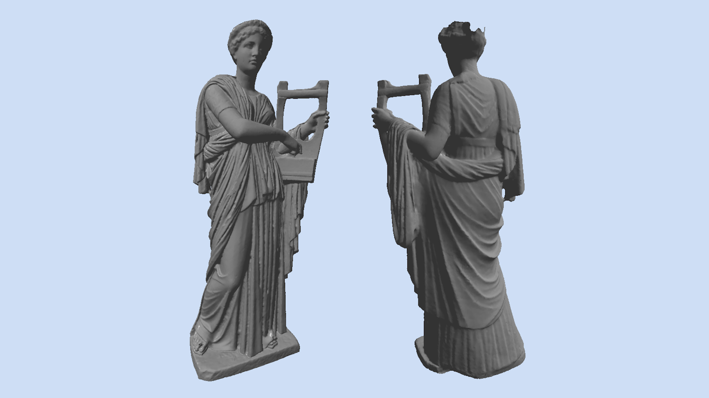
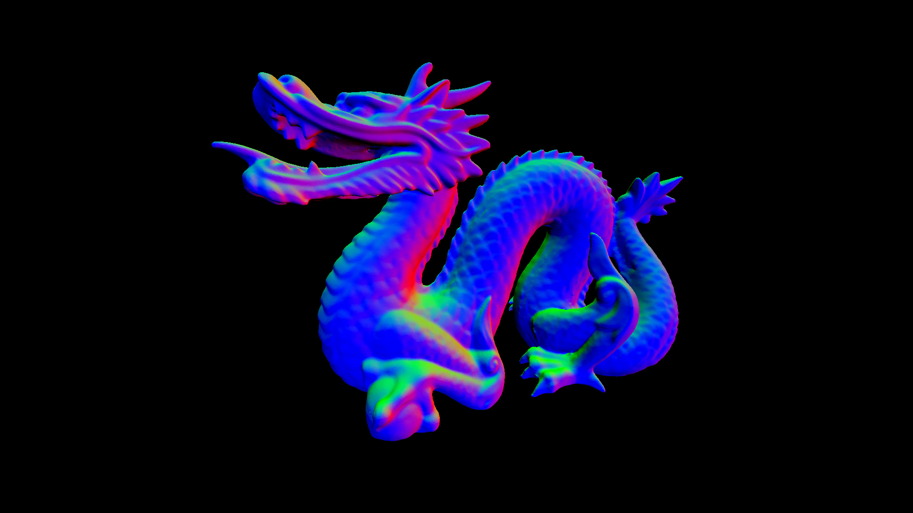
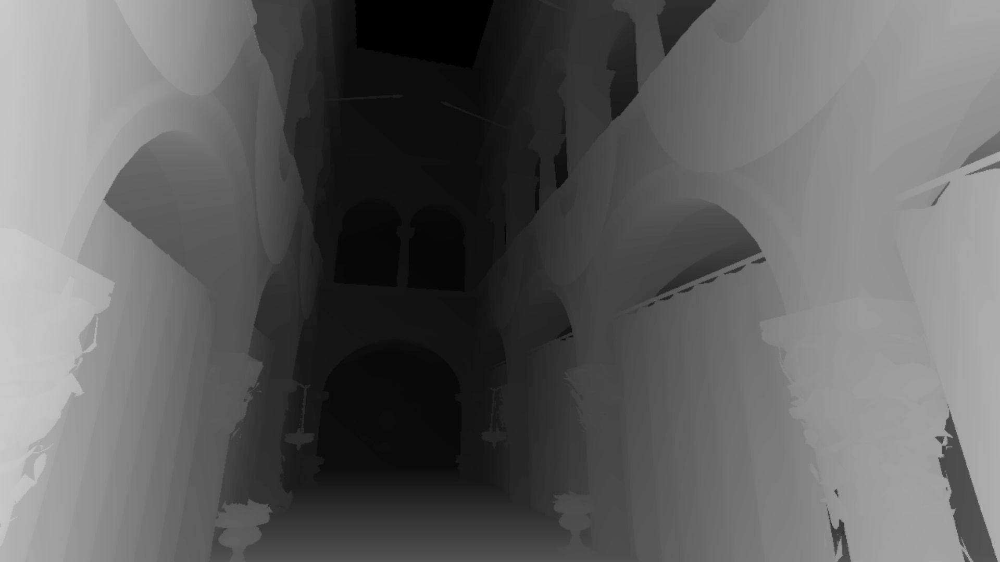
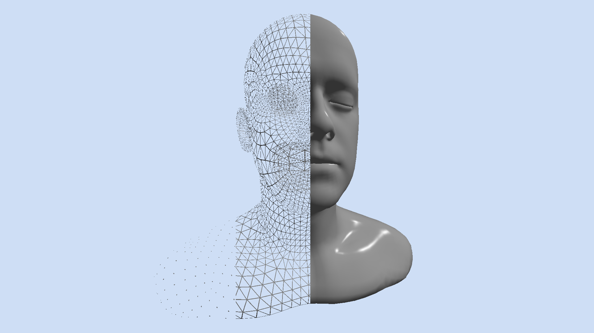
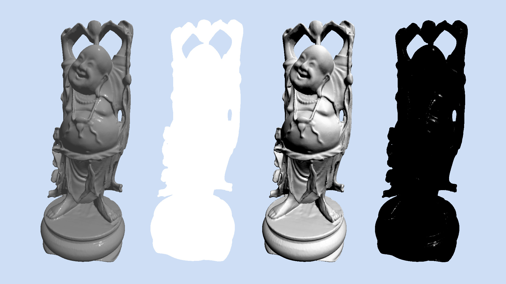

# CUDA Rasterizer

> Real-time CUDA software rasterizer with binning triangle sorting.
> View-frustum clipping, back-face and degenerate triangles culling.
> Blinn-Phong illumination model with robust non-uniform scaling of normals and per-pixel interpolation.
> Custom PowerShell build system.

Bachelor thesis supervised by [Jiří Bittner](https://usermap.cvut.cz/profile/6ce458e5-3ecd-47e1-9302-087938c54ab2) and reviewed by the opponent [Jaroslav Sloup](https://usermap.cvut.cz/profile/6601e744-a94f-4ba8-bc94-10c366c1850a), written in C, CUDA in 2023.
You can read their reviews on [the public thesis webpage](https://dspace.cvut.cz/entities/publication/47e89c7e-b645-4054-a292-5c85c7f9ff7e).
I was awarded the B grade.

