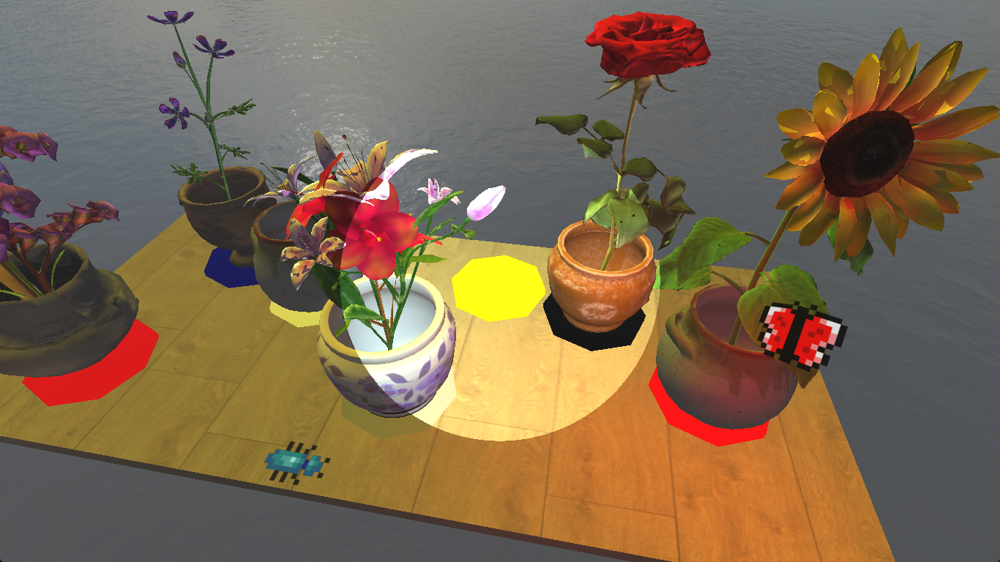
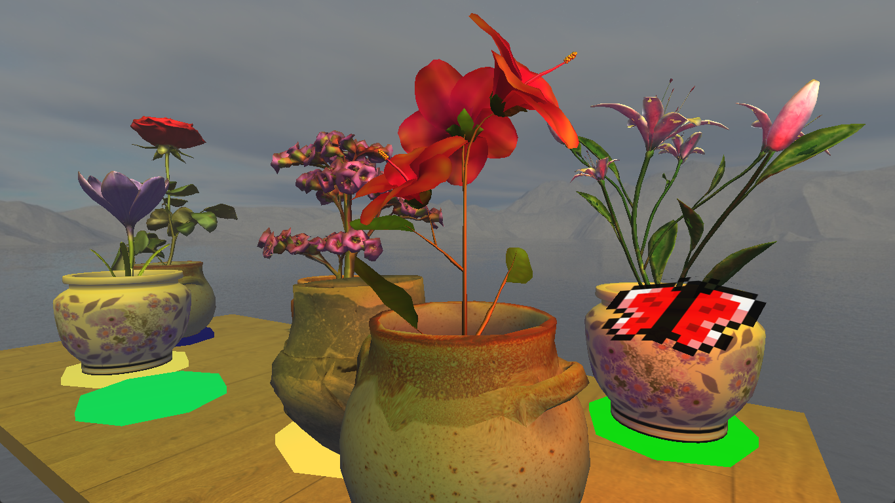

# Flower OpenGL

> OpenGL interactive scene.
> Object picking via the stencil buffer.
> Multiple camera modes with seamless transitions.
> Distance-based exponential fog.
> Alpha blended transparency.
> Vertex displacement and texture-coordinate animations.
> Multiple light sources.
> Custom hierarchical scene graph loaded from a text file.

Project for [Computer Graphics Programming](https://bilakniha.cvut.cz/en/predmet4722306.html) course taught by [Petr Felkel](https://usermap.cvut.cz/profile/c36f209c-0288-456f-9969-22ffdca27668) and [Jaroslav Sloup](https://usermap.cvut.cz/profile/6601e744-a94f-4ba8-bc94-10c366c1850a), written in C++ in 2023.
It is rendered using OpenGL, uses FreeGLUT for window management.
You can download an executable from [the project archive](https://cent.felk.cvut.cz/courses/PGR/archives/2022-2023/S-FEL/profojak/).

