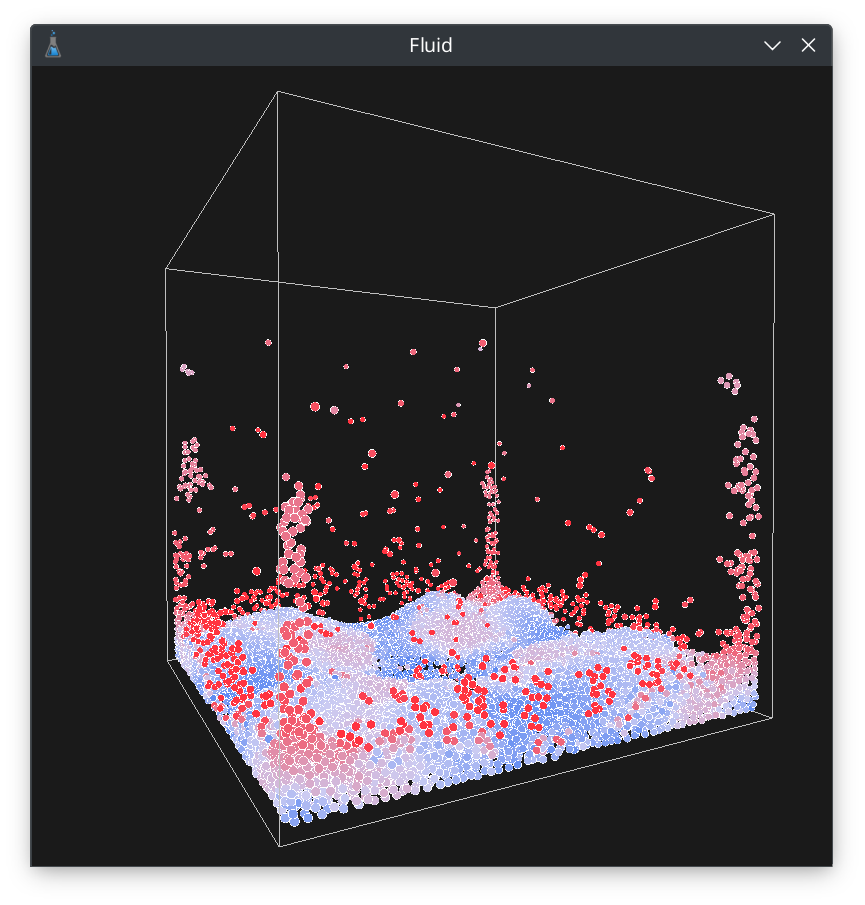
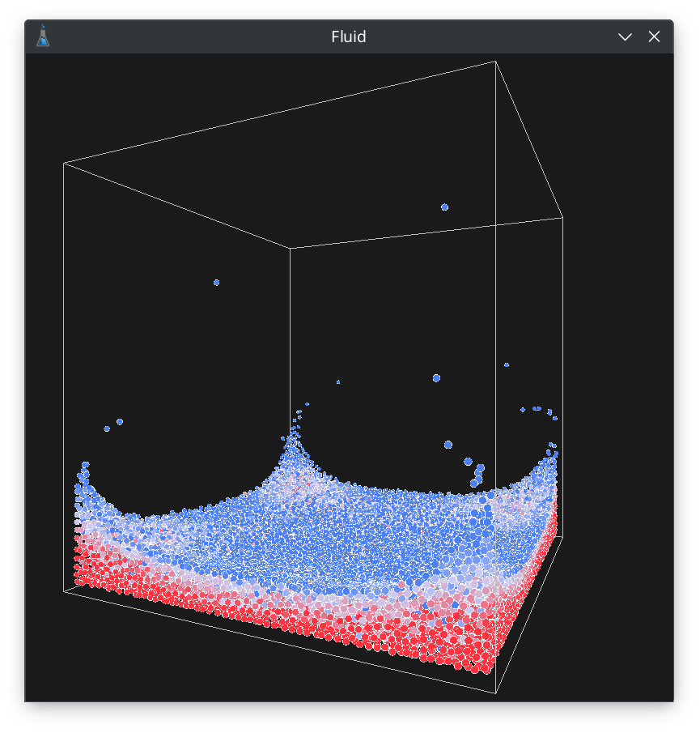
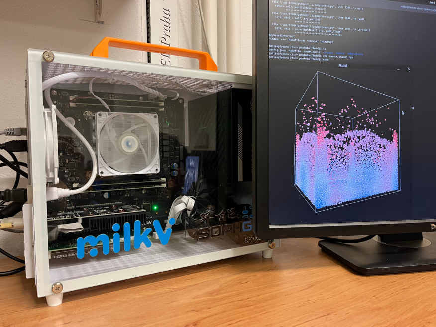

# Fluid Simulation

> Interactive fluid simulation using smoothed particle hydrodynamics numerical solver.
> Solid particle simulation space boundaries.
> Efficient neighbor search via uniform grid sorting.
> Support for multi-threaded, GPU accelerated, and half-baked distributed workloads using OpenMP, CUDA, and MPI.

Project for [General-Purpose Computing on GPU](https://bilakniha.cvut.cz/en/predmet4696906.html) course taught by [Jaroslav Sloup](https://usermap.cvut.cz/profile/6601e744-a94f-4ba8-bc94-10c366c1850a), written in C++, CUDA, OpenMP, MPI in 2025.
It is rendered using OpenGL and GLEW wrangler, uses SDL2 for window management, GLM for the math.
You can download an executable from [the project archive](https://cent.felk.cvut.cz/courses/GPU/archives/2024-2025/W/profojak/).
One little achievement of mine is that this is most likely the first fluid simulation being run on a 64-core RISC-V CPU in [Milk-V Pioneer](https://milkv.io/pioneer) system gifted to [Pavel Píša](https://usermap.cvut.cz/profile/bc23926a-dd9a-4c16-bac3-cd6091d3c343).

