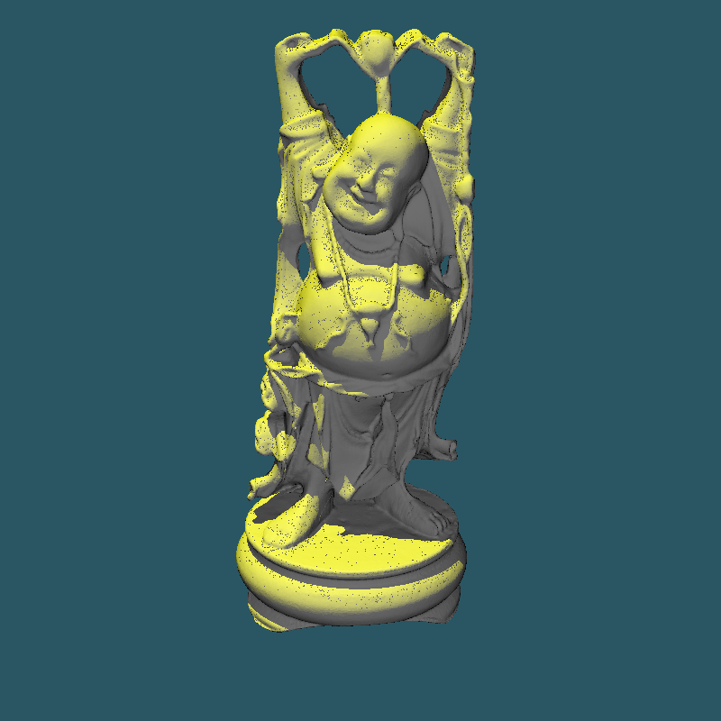
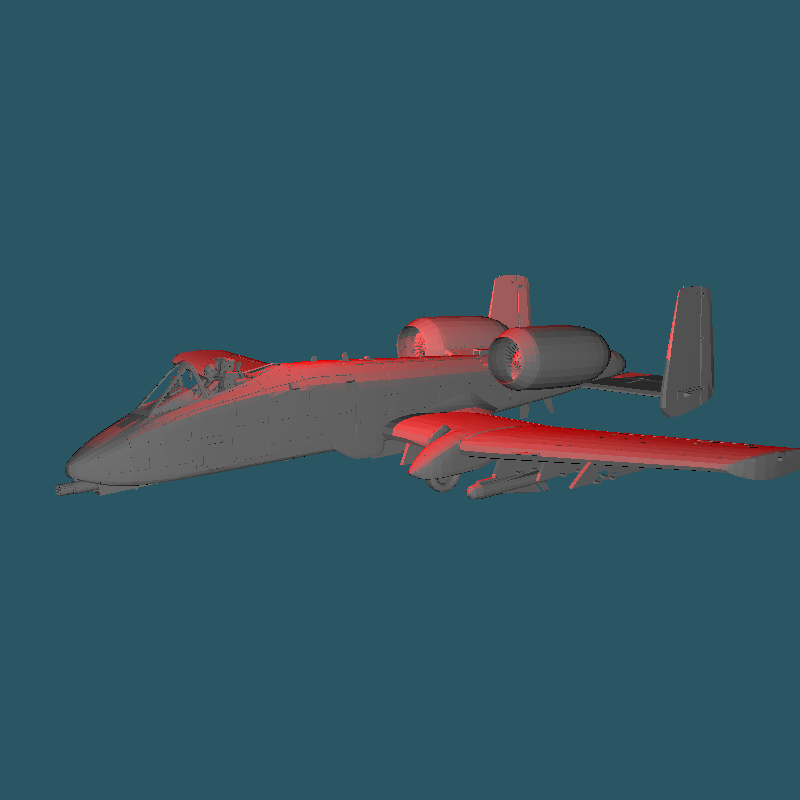
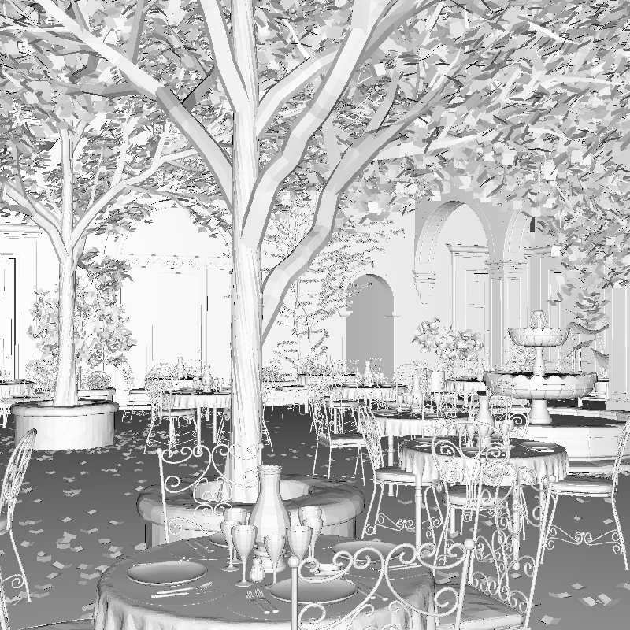
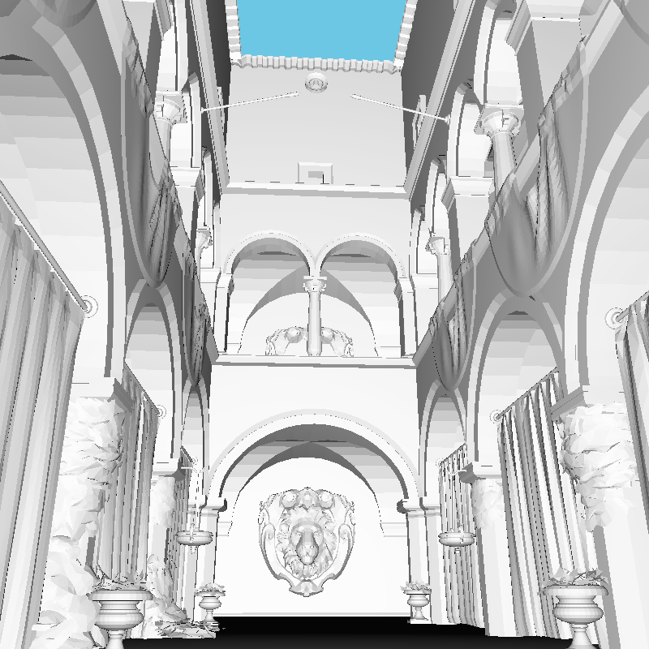

# kd-tree

> Spatial kd-tree data structure for ray tracing.
> Surface area heuristic cost model with single-pass binning for finding the minimum cost split plane.
> Clipping of triangles straddling the splitting plane.
> Pruning of empty child nodes.
> Stack-based recursive ray traversal.

Project for [Data Structures for Computer Graphics](https://bilakniha.cvut.cz/en/predmet4699906.html) course taught by [Vlastimil Havran](https://usermap.cvut.cz/profile/67fcac2a-a32d-46af-b2a3-04c3f0ed08a1), written in C++ in 2024.
I am prohibited from sharing the whole code due to the proprietary license of the framework provided by the professor, but I at least ripped out the header and source file of the kd-tree.
The implementation and report was the only one in that year's class to be awarded full points.

