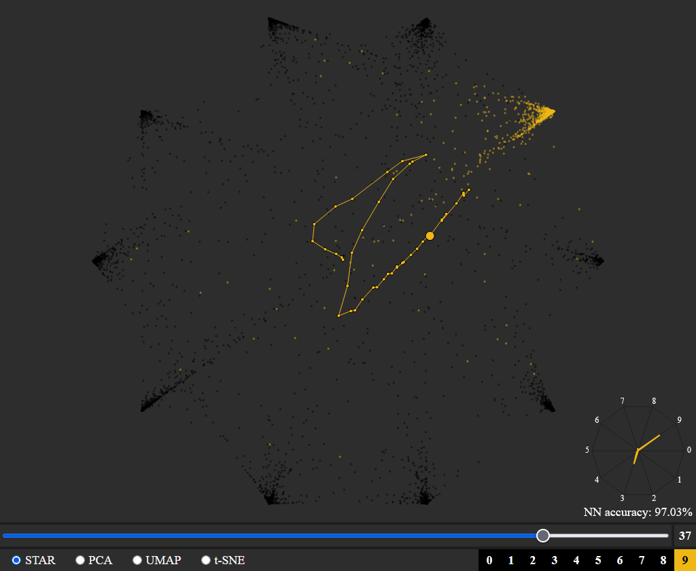
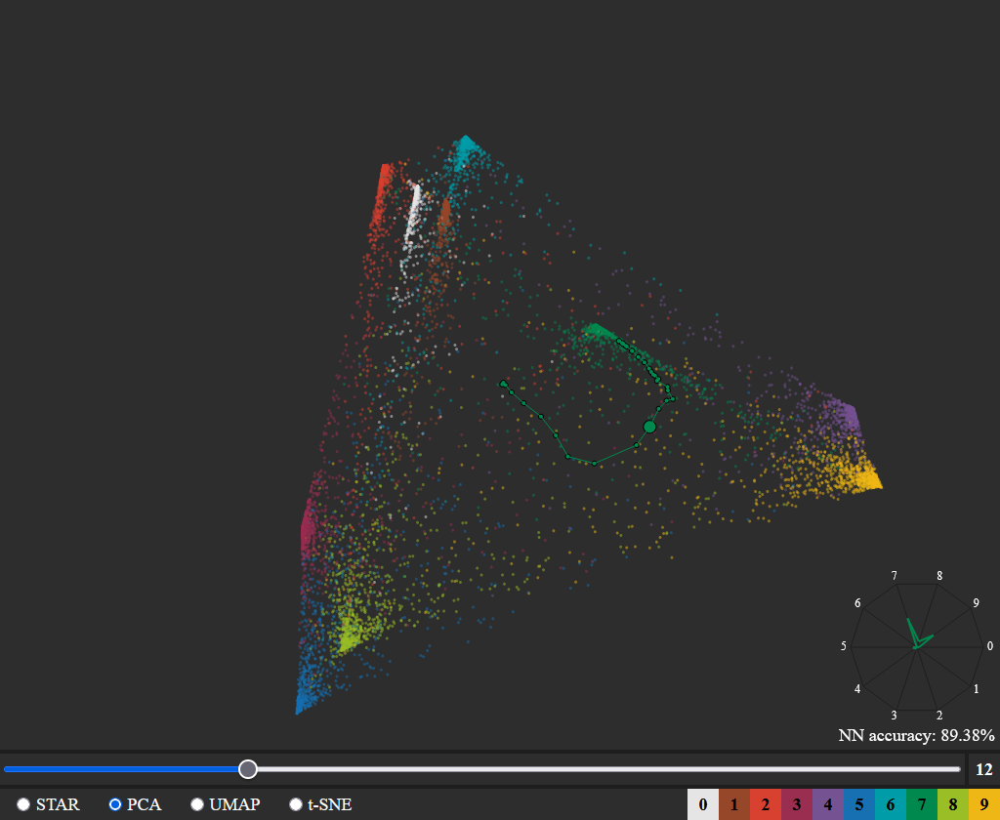
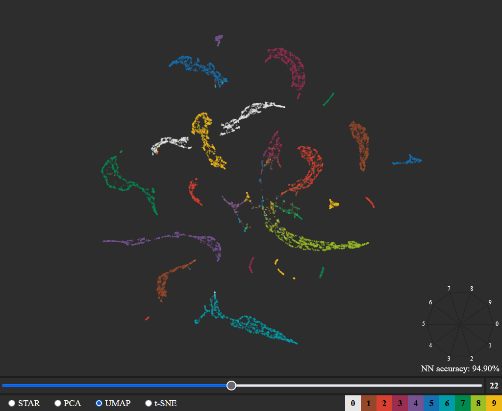
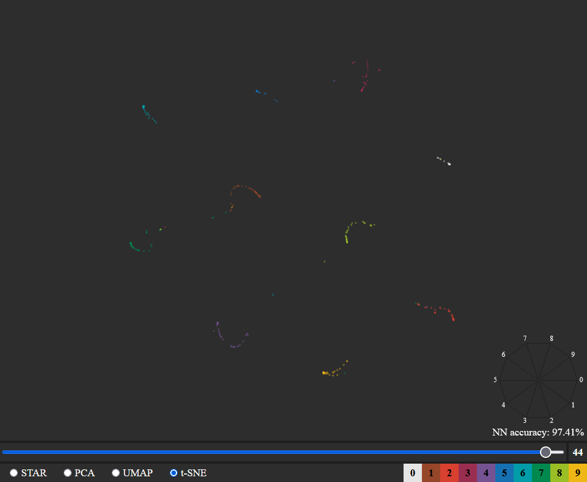

# Neural Network Visualization

> Training process visualization of neural network for MNIST image classification.
> Four different dimensionality reducing embedding projections to 2D.
> Caching for individual image inspection.

Project for [Visualization](https://bilakniha.cvut.cz/en/predmet4699806.html) course taught by [Ladislav Čmolík](https://usermap.cvut.cz/profile/63588b16-9203-4ef3-a8d5-9e7cd1f30476), written in JavaScript, Python in 2025 by two people.
You can [try the project](https://nn-visualization-4310e2.pages.fel.cvut.cz/) in your browser.

