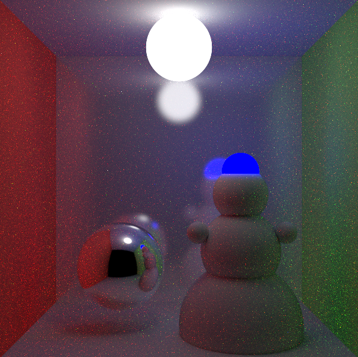
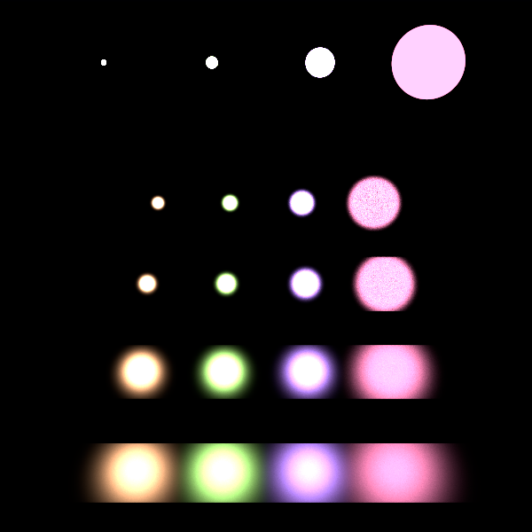
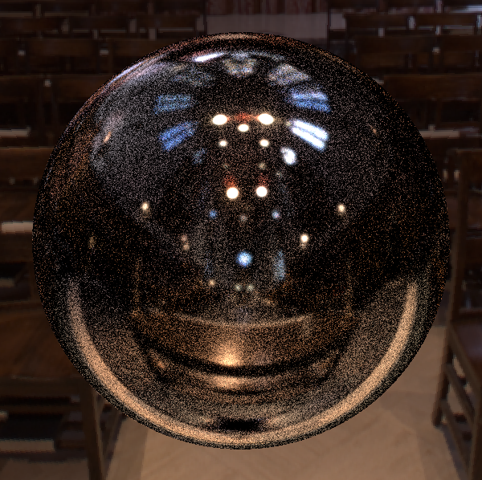
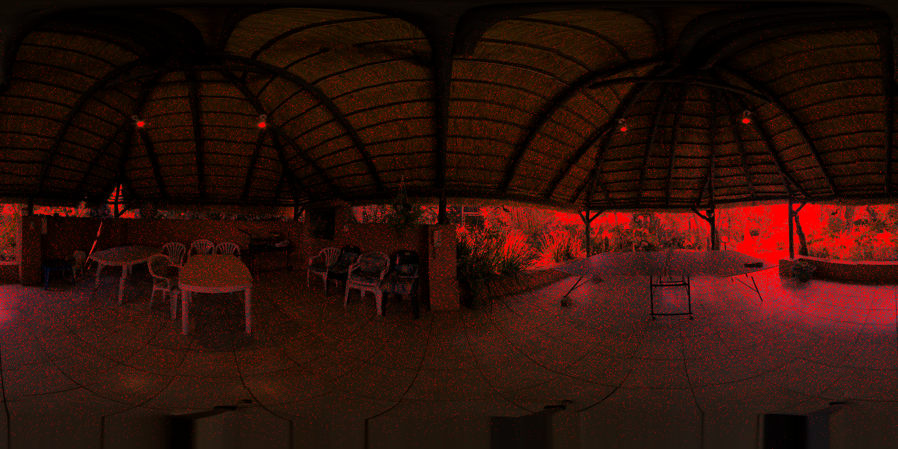

# Path Tracer

> Physically-based unbiased Monte Carlo path tracer.
> Russian roulette sample rejection.
> Multiple importance sampling to balance light and BRDF cosine sampling.
> Importance sampling of environment maps.

Project for [Realistic Image Synthesis](https://bilakniha.cvut.cz/en/predmet4725206.html) course taught by [Vlastimil Havran](https://usermap.cvut.cz/profile/67fcac2a-a32d-46af-b2a3-04c3f0ed08a1), written in C++.
I am prohibited from sharing the code due to plagiarism concerns, but you can read the reports with the code snippets.

