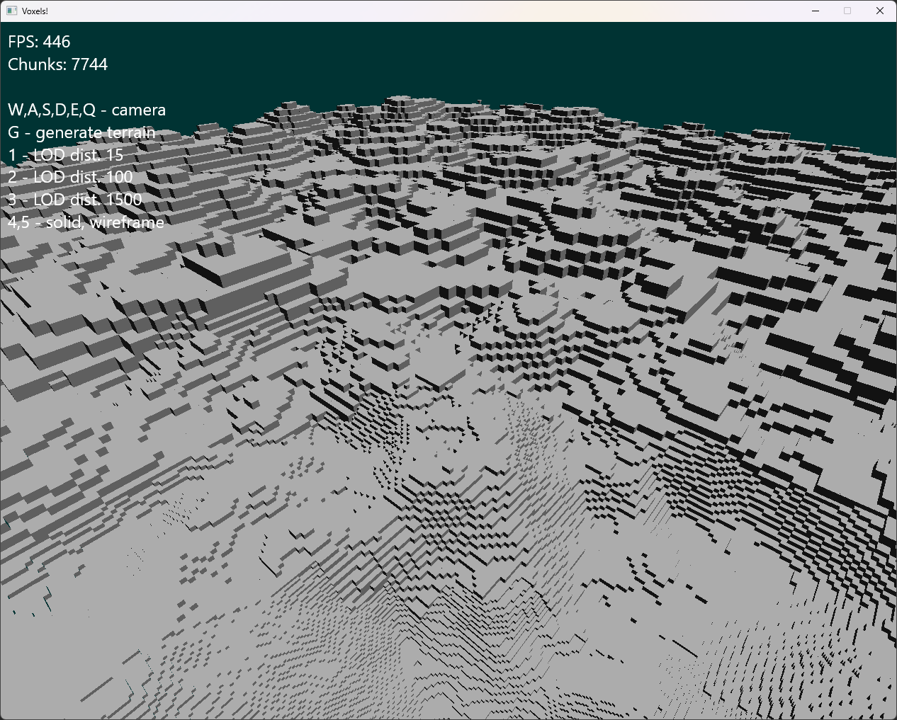
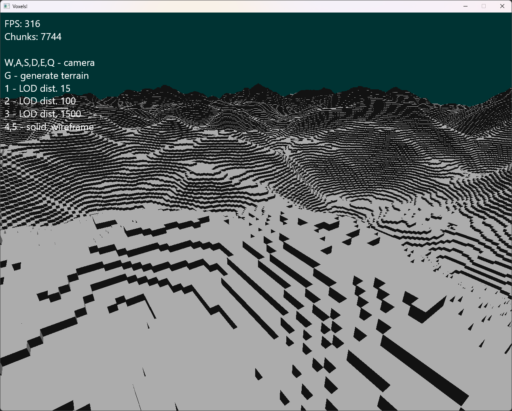
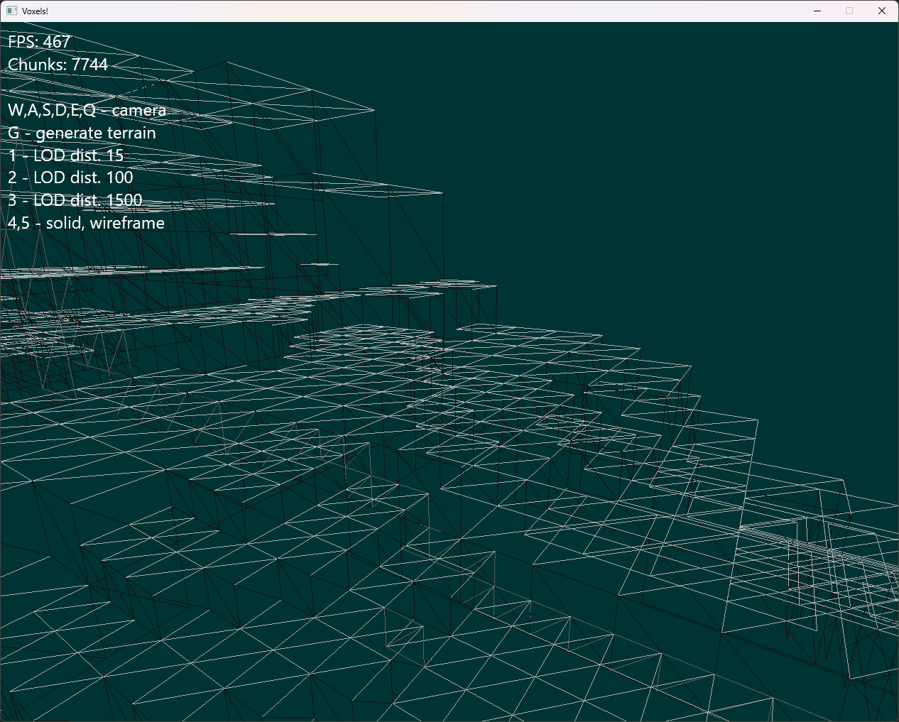

# Voxel Renderer

> DirectX 11 vertex engine with asynchronous multi-threaded chunk generation.
> Automatically generated level of detail meshes from the voxels.
> Occlusion culling.

Project for [Computer Graphics for Game Development](https://is.cuni.cz/studium/eng/predmety/index.php?do=predmet&kod=NPGR033) course taught at MFF UK, written in C++ in 2025 by two people.
It is rendered using DirectX 11, uses native Win32 API for window management.

