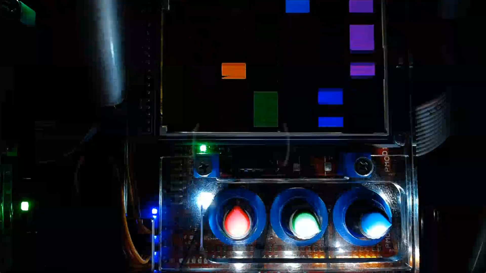

# ap8

> 8-bit music sequencer built for the ARM-based MicroZed educational board.
> Creates, edits, and plays back musical sequences.
> Interacts directly with LCD, LEDs, and knobs via physical address mapping.
> Developed entirely remotely during the covid times thanks to SSH, video live-streaming, and servos to rotate the knobs (big shoutout to the teacher!).

Project for [Computer Architectures](https://bilakniha.cvut.cz/en/predmet5099306.html) course taught by [Pavel Píša](https://usermap.cvut.cz/profile/bc23926a-dd9a-4c16-bac3-cd6091d3c343), written in C in 2020.

